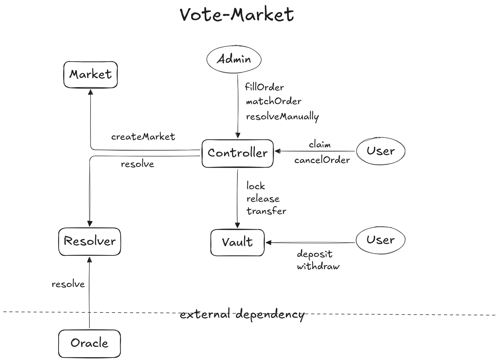

## Vote-Market Protocol Architecture

Vote-Market is a decentralized prediction market protocol designed with a hybrid architecture to achieve efficiency, scalability, and an optimal user experience. The diagram below outlines the core components and their interactions.

### Core Components (Smart Contracts)

The protocol is composed of several key smart contracts, each with a specific responsibility to ensure a clear separation of concerns and enhanced security.

*   **`Controller.sol`**
    This is the central hub of the protocol. It handles all core business logic, including trade execution, prize claims, and serves as the sole point of interaction between the various system components.

*   **`Vault.sol`**
    This contract is solely responsible for collateral management. Users `deposit` and `withdraw` their assets from the `Vault`. The `Controller` can then `lock`, `release`, and `transfer` funds within the `Vault` to cover trading positions without the assets ever leaving the security of the contract.

*   **`Market.sol`**
    This acts as a registry for all markets. When a new market is created, the `Controller` stores essential metadata such as the market ID, number of outcomes, and deadline within the `Market` contract.

*   **`Resolver.sol`**
    This contract manages the market resolution process. When a market ends, the `Controller` triggers the `Resolver`, which then communicates with an external `Oracle` to obtain the true outcome of the real-world event.

*   **`Oracle`**
    This is a crucial external dependency that sits outside the core system. The Oracle serves as a bridge between the real world and the blockchain, providing tamper-proof outcome data to the `Resolver`. The security and reliability of the Oracle are paramount to the integrity of the entire protocol. [1, 2, 3]

### Actors and Roles

*   **`User`**
    Users are the market participants. They can deposit/withdraw funds from the `Vault` and interact with the `Controller` to `claim` winnings or `cancelOrder`s.

*   **`Admin`**
    This is a privileged role responsible for managing trading operations. The `Admin` matches orders (`matchOrder`) and executes them (`fillOrder`) via the `Controller`. This role also has the ability to `resolveManually` in case of an emergency or oracle failure.

### Key Workflows

1.  **Market Creation (`createMarket`)**
    *   The `Controller` calls the `createMarket` function on the `Market` contract to register a new market with its defined parameters (e.g., question, number of outcomes, and deadline).

2.  **Trading (`deposit`, `fillOrder`, `lock`)**
    *   A `User` deposits collateral (e.g., USDC) into the `Vault`.
    *   Orders are created and matched off-chain by the `Admin` for gas efficiency.
    *   The `Admin` then submits the matched orders to the `Controller` for execution (`fillOrder`).
    *   The `Controller` validates the order and instructs the `Vault` to either `lock` the relevant funds or perform an internal `transfer` between user balances.

3.  **Resolution & Claiming (`resolve`, `release`, `claim`)**
    *   After a market ends (passes its deadline), the `Controller` triggers the `Resolver`.
    *   The `Resolver` requests the outcome from the external `Oracle`.
    *   Once the outcome is received, the `Controller` marks the market as resolved.
    *   Winning users can now call the `claim` function on the `Controller`.
    *   The `Controller` then instructs the `Vault` to `release` the locked funds to the winners.